# DecisionGraph + AgentNet — Visual Guide

> A page-by-page walkthrough in plain English of every screen in the app.
> Mirror of the in-app guide at **http://localhost:8000/docs** (interactive HTML).
> All diagrams below are Mermaid — they render directly on GitHub.

---

## Contents

1. [The big picture — two halves, one platform](#1-the-big-picture)
2. [Knowledge Base — how data gets in](#2-knowledge-base)
3. [Query Terminal — how knowledge comes out](#3-query-terminal)
4. [Brain — the recall + consolidation page](#4-brain)
5. [MCP · AgentNet — the keycard system](#5-mcp--agentnet)
6. [Simulation Studio — Mirofish + TimesFM](#6-simulation-studio)
7. [Marketplace — bring-your-own agent / list-your-own](#7-marketplace)
8. [Agents — minting scoped grants](#8-agents)
9. [Dashboard — the four numbers + network](#9-dashboard)
10. [Orchestration — multi-agent coordination](#10-orchestration)
11. [How-to recipes](#11-how-to-recipes)
12. [What's new since v2](#12-whats-new-since-v2)

---

## 1. The big picture

**Two products in one app.**

DecisionGraph **remembers** everything your company has ever decided — turning
PDFs, emails, transcripts, decisions into a connected map of knowledge.
AgentNet sits **on top**: AI agents (yours, mine, anyone's) can be hired to
work on that knowledge, safely and audited.

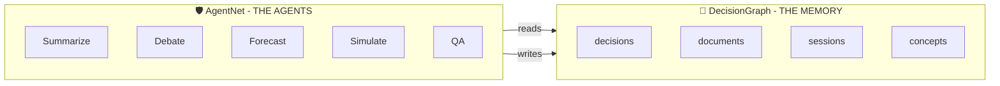

Think of a company. It makes thousands of decisions a year — pricing tweaks,
hiring choices, product pivots. Most live in someone's head, a Slack channel,
a forgotten PDF, an unrecorded meeting. DG captures all of that. AgentNet is
the **governance layer** that lets agents safely work on it.

---

## 2. Knowledge Base

> 📚 **The front door of DecisionGraph.** Every piece of information that
> becomes part of your institutional memory enters here.

Two lanes side-by-side:

| Lane | What it is |
|---|---|
| **Personal Knowledge Graph** | Your private graph. No one else sees it. |
| **Company Memory** | Multi-tenant workspaces — fully isolated per company. |

### How it works — the journey of one document

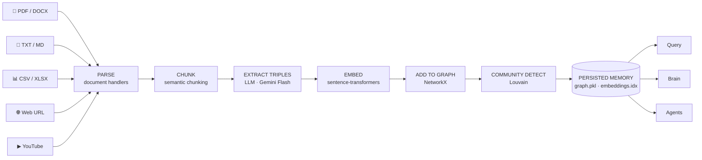

**Plain-English walkthrough:**

1. **Read it** — opens the file and pulls out the words, no matter the format.
2. **Cut it into pieces** — long text is sliced into bite-sized passages so it
   can be searched fast later.
3. **Find the facts** — an LLM reads each piece and pulls out little facts like
   *"Acme launched Atlas in 2024"* or *"Sarah leads product."*
4. **Remember the meaning** — every piece gets a *meaning fingerprint*
   (embedding) so you can search by idea, not just exact words.
5. **Connect the dots** — facts are added to a giant web. If "Atlas" was
   mentioned in three files, the three files are now linked through Atlas.
6. **Group related stuff** — Louvain detects clusters (e.g. "everything about
   pricing") and labels them as topics.
7. **Save it all** — graph, embeddings, and topics are persisted to disk,
   ready the moment you ask a question.

### The three input modes

```
┌──────────────────────┐   ┌──────────────────────┐   ┌──────────────────────┐
│  📄 File drop        │   │  🌐 Web URL          │   │  ▶ YouTube URL      │
│  PDF · TXT · MD      │   │  Article / docs page │   │  Auto-transcribed   │
│  DOCX · CSV · XLSX   │   │  → BeautifulSoup     │   │  via Whisper-style  │
│  Parsed → chunked    │   │    extract → same    │   │  → same pipeline    │
│  → triples → graph   │   │    pipeline          │   │                     │
└──────────────────────┘   └──────────────────────┘   └──────────────────────┘
```

### Your stuff stays your stuff

Personal graphs are visible **only to you** via your visitor cookie. Company
workspaces are isolated from each other. No cross-leakage.

### What AI assistants can do here on their own

* `ingest_document(path)` — drop in a file
* `ingest_github(url)` — pull a full repo
* `get_stats()` — check what's in the graph

---

## 3. Query Terminal

> 🔍 **The way to talk to your memory.** Type a question; DG searches across
> documents, decisions, and concepts to answer.

### How it works — what happens when you press Query

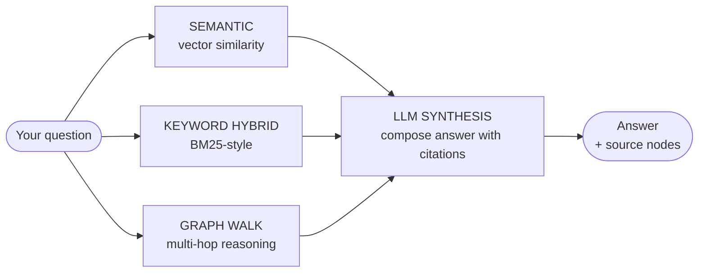

### The four ways to ask

| Mode | What it does | When to use |
|---|---|---|
| **Semantic** | Cosine similarity over embeddings | "What was decided about pricing?" |
| **Keyword (hybrid)** | BM25 + semantic blended | Specific terms, names, IDs |
| **Graph walk** | Multi-hop reasoning through relationships | "How does X relate to Y?" |
| **LLM synthesis** | Composes a final answer with citations | Always runs on top of the others |

**The "Hybrid retrieval" tick-box** blends semantic + keyword — better when
your question contains specific names or product IDs.

**Personal vs Company toggle** lets you scope the query to your private graph
or a specific company workspace.

### What AI assistants can do here on their own

* `query_knowledge(question)` — ask
* `recall(entity)` — fast NO-LLM lookup
* `get_past_decisions(context)` — find similar past decisions

---

## 4. Brain

> 🧠 **The recall + consolidation page.** Three panels work together.

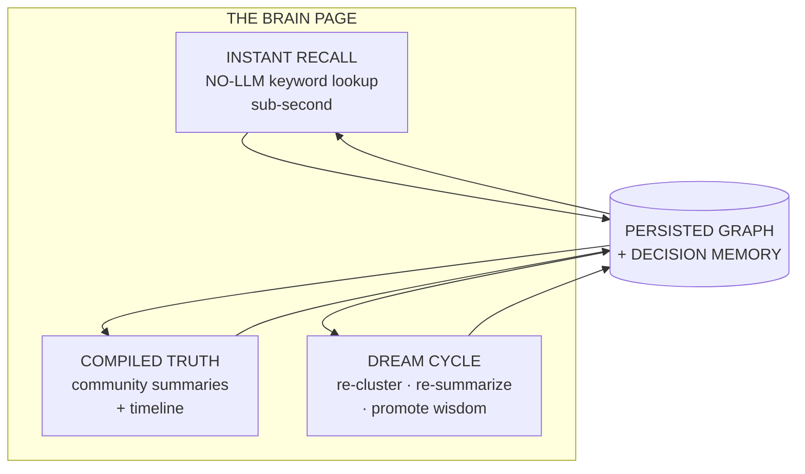

### Instant Recall — why it's so fast

No LLM. Pure SQL over the decision index. Type a name or entity, see every
high-confidence active decision mentioning it (newest first) plus its
neighbourhood in the graph. Sub-second.

### Compiled Truth + Timeline

The community summaries (one per Louvain cluster) plus a chronological view of
decisions. Use to scan *"what does the graph think it knows about pricing?"*
without writing a query.

### Dream Cycle — the tidy-up button

A periodic background pass that:

1. Re-runs Louvain over the merged graph.
2. Re-summarizes drifted clusters with the LLM.
3. Computes a `wisdom_score = confidence × outcome_impact × access_count`.
4. Promotes high-scorers into reusable **compiled** summaries that future
   queries retrieve first.

Turns ephemeral facts into long-term patterns.

### Export Markdown

One-click export of the current Compiled Truth + Timeline as a portable
Markdown report.

### What AI assistants can do here on their own

* `recall(entity)` — Instant Recall
* `query_knowledge(question, mode="compiled")` — Compiled Truth
* `dream_run()` — trigger consolidation (via REST `/api/dream/run`)

---

## 5. MCP · AgentNet

> 🔌 **The door agents come through.** Any MCP-compatible client (Claude
> Code, Cursor, Antigravity) connects via a keycard — owner or scoped.

### The keycard system

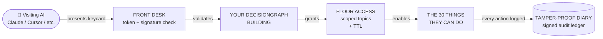

### The two keycards

| Keycard | Scope | Use case |
|---|---|---|
| **Owner connection** | Full read/write across your workspace | Your own Claude Code / Cursor session |
| **Scoped agent grant** | Restricted topics + TTL (e.g. "read-only auth/, expires in 30 min") | Hiring a marketplace agent / running a sandboxed task |

### Mint owner connection

DG UI → MCP · AgentNet → **Mint owner connection** — copies an MCP config
block straight into your editor's MCP config file.

### Mint scoped agent

DG UI → MCP · AgentNet → **Mint scoped agent** — pick topics + TTL + write
permission, get back a token you paste into the agent's config.

### The 30 actions an agent can do, by area

> Full table with 2-line descriptions in
> [`../README.md#7-all-30-mcp-tools-2-lines-each`](../README.md).
> Grouped by area:

| Area | Tools |
|---|---|
| **Discovery** | `list_companies`, `get_stats`, `code_graph_stats`, `suggested_questions`, `get_onboarding_brief` |
| **Memory read** | `query_knowledge`, `recall`, `get_past_decisions`, `get_context_pack` |
| **Memory write** | `store_decision`, `track_decision`, `track_code_edit`, `ingest_document`, `ingest_github`, `update_files` |
| **Code structure** | `find_callers`, `find_callees`, `find_call_path`, `blast_radius`, `causal_radius`, `topology`, `rationales`, `semantic_stale`, `recent_code_edits` |
| **Cross-repo (federated)** | `federated_callers`, `federated_topology`, `federated_rationale_search` |
| **PR/triage** | `triage_pr` |
| **Export** | `export_graph_html`, `export_graph_cypher` |

### The diary — why nothing can be hidden

Every grant mint, every tool call, every write — **signed** with the agent's
key, **replayable**. You can reconstruct exactly what an agent did, when, and
why, after the fact.

### The keycard machine itself

`decisiongraph/agent_access.py` mints grants; `agent_crypto.py` does
signatures; `agent_messages.py` is the inter-agent bus; `agent_sandbox.py`
is the isolation envelope.

---

## 6. Simulation Studio

> 🧪 **What-if scenarios on top of your memory.** Backed by Mirofish (an
> agent-based simulator) with a 3-step fallback chain.

### How it's wired

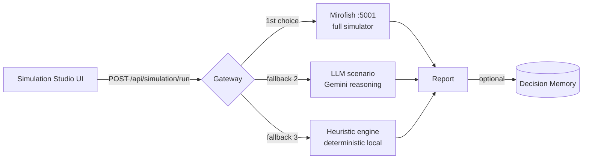

### How it works (step by step)

1. You describe a scenario in natural language (or pick a template).
2. The gateway tries Mirofish on **port 5001** first — full agent-based sim.
3. If Mirofish is down, falls back to an LLM reasoning pass.
4. If the LLM is rate-limited, falls back to a deterministic heuristic engine
   so you always get *some* answer.
5. The report comes back with key drivers, sensitivity table, and a
   confidence band.

### The report you get back

* **Summary** — one-paragraph executive view.
* **Key drivers** — variables that moved the outcome most.
* **Sensitivity** — what changes if you tweak each driver ±10%.
* **Risk band** — best / expected / worst case.

### "Store in Decision Memory" button

One click persists the simulation as a `simulation` decision node, so the
next time someone asks *"what did we model about Q4 pricing?"* it surfaces.

### Which engine is running it

A small badge on the report tells you whether Mirofish, LLM, or Heuristic
produced it — full transparency.

### Time-series forecasting (bottom of the page) — TimesFM

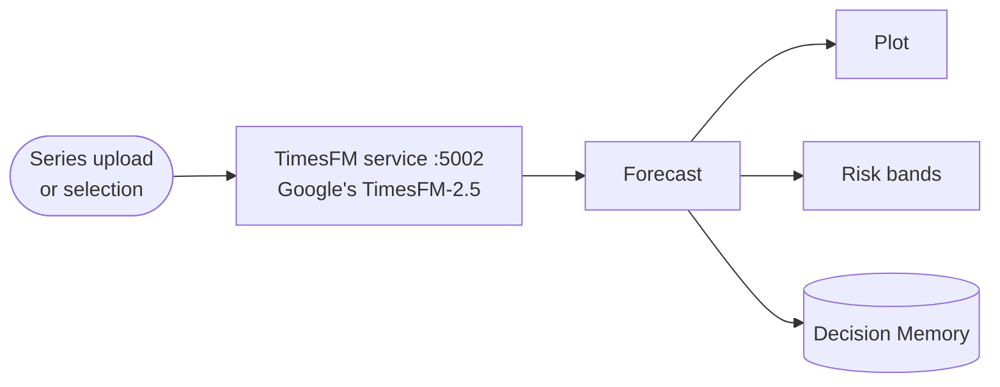

**Why a three-step fallback chain?** Because real users hate "service
unavailable." A degraded answer is better than no answer.

### What AI assistants can do here on their own

* `POST /api/simulation/run` — kick off a scenario
* `POST /api/forecast` — kick off a forecast

---

## 7. Marketplace

> 🛒 **Agent Marketplace.** Hire pre-built agents, or list your own.

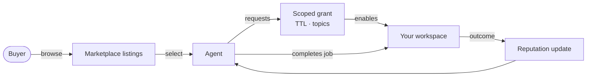

### How it's wired

* Marketplace UI calls `/api/agents/listings` for the directory.
* `Connect your own agent via MCP` box renders the MCP config snippet for a
  scoped grant.
* `+ list your own agent` opens the seller form.
* Bundled and third-party agents are tick-boxes you can filter on.

### The "Connect your own agent via MCP" box

Generates an MCP config block with a fresh scoped grant token pre-filled —
paste into Claude Code / Cursor / Antigravity and you're connected.

### What AI assistants can do here on their own

* `list_agents()` — discover available agents
* (Seller side) `register_listing(...)` — list your own

---

## 8. Agents

> 🔑 **Where you mint scoped grants and run sample agents.**

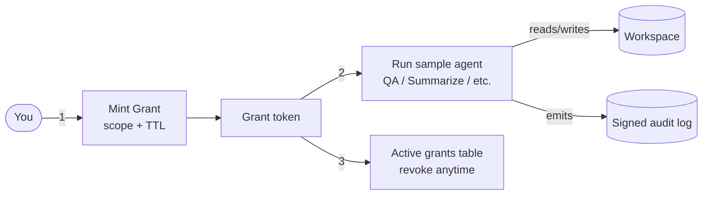

### 1 · Mint a scoped grant

Pick topics (e.g. `["pricing", "auth"]`), max-write toggle, TTL.

### 2 · Run sample agent

Pre-bundled agents (QA, Summarize, Forecast) you can hit with one click to
verify the grant works.

### 3 · Active grants table

Every grant you've minted, with usage count and a **Revoke** button.

### The safety guarantees in one line

> *Time-limited, topic-scoped, signed-and-audited keycards — revocable any
> time.*

### What AI assistants can do here on their own

* `mint_grant(scope, ttl)` — programmatic grant minting
* `revoke_grant(token)`
* `list_grants()`

---

## 9. Dashboard

> 📊 **The control room.** Four big numbers at the top, network directory
> below.

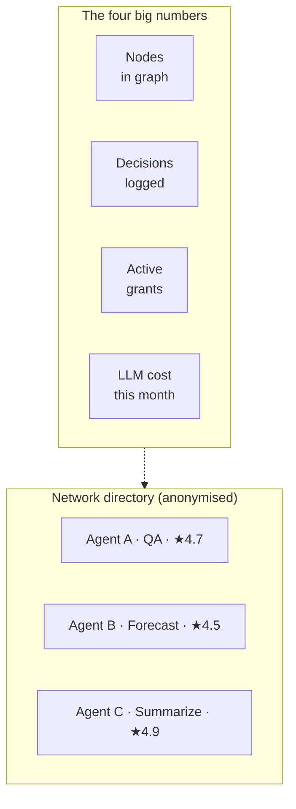

### The four big numbers at the top

| | What it counts |
|---|---|
| **Nodes** | total concept nodes in your knowledge graph |
| **Decisions** | active high-confidence decisions logged |
| **Active grants** | grants currently within TTL |
| **LLM cost (month-to-date)** | tracked against your rate-limit ceiling |

### Network directory (anonymised)

Lists peer agents on the network with their stated capabilities and
**anonymised reputation scores**. Click any row to mint a job offer.

### Why the network view exists

Because hiring agents from outside your org needs a trust signal. Reputation
+ signed audit history = the trust signal.

---

## 10. Orchestration

> 🎼 **Multi-agent coordination.** Hire several agents in parallel, debate,
> or pipeline them.

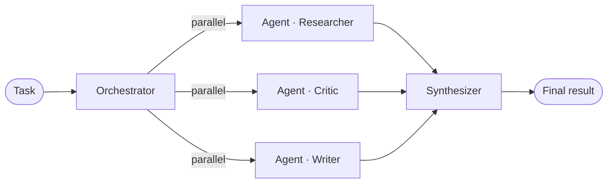

### Patterns supported

* **Parallel** — three agents work the same task; orchestrator picks/merges
  the best.
* **Debate** — agent A proposes, agent B critiques, loop until convergence.
* **Pipeline** — output of one feeds the next (Researcher → Writer → Reviewer).
* **Shared tools** — multiple agents share a single MCP tool palette with
  topic-scoped grants per agent.

---

## 11. How-to recipes

### Mint your first agent

1. **Agents** page → **Mint a scoped grant** → pick topics + TTL.
2. Copy the token.
3. Paste into your editor's MCP config (see [README §6](../README.md)).

### Connect Claude Code (owner mode)

1. **MCP · AgentNet** page → **Mint owner connection**.
2. Copy the rendered config block.
3. Paste into `~/.claude.json` → restart Claude Code.

### Connect a scoped agent

Same as above, but use a **scoped grant** from the Agents page instead of
the owner connection.

### Parallel agents

```
Orchestration page → "Parallel" template → pick 3 agents → Run
```

### Loop / debate agents

```
Orchestration page → "Debate" template → propose + critique pair → Run
```

### Time-series forecast

1. **Simulation Studio** → bottom panel.
2. Upload series CSV or pick from existing.
3. Choose horizon.
4. Hit **Forecast** — TimesFM runs on port 5002.

### Use the Brain

* **Instant Recall** — type an entity, see every active decision mentioning it.
* **Compiled Truth** — scan community summaries.
* **Dream Cycle** — click "Tidy up" to re-cluster the graph.

### Sell on AgentNet

1. **Marketplace** → `+ list your own agent`.
2. Fill the seller form (name, capabilities, pricing, MCP endpoint).
3. Submit — your agent appears in the network directory.

---

## 12. What's new since v2

### GitHub repo → DG

```bash
POST /api/ingest/github  {"repo_url": "https://github.com/owner/repo"}
```
Shallow-clones, tree-sitter chunks, summarizes every file/folder with the
LLM, builds a call graph, captures PRs, and uses an incremental hash cache
so re-ingests only process changed files.

### AI edit capture

After every meaningful code change, the agent calls `track_code_edit`. The
platform computes the diff, stores it as a permanent decision tagged
WHO/WHEN/WHERE/WHY. Permanent audit trail of AI-driven changes.

### AI Agent Reputation

Each agent carries a score that decays on failures and rises on outcomes.
Circuit breaker trips after `maxConsecutiveFailures`, blocking the agent
until cooldown.

### Onboarding Companion

`get_onboarding_brief()` returns a one-shot "what to know" bundle for a new
joiner or new AI session — overview, active topics, recent decisions,
recently-edited files, who's been touching the code. Ready-to-paste
`brief_text` included.

### Git post-commit hook

Auto-captures every commit as a decision node (author, repo, subject, body)
via `track_decision`. So `git log` becomes queryable institutional memory.

```bash
# DG UI generates the hook for you:
curl http://localhost:8000/api/integrations/git/post-commit > .git/hooks/post-commit
chmod +x .git/hooks/post-commit
```

---

> **End of guide.** For the API reference see `localhost:8000/swagger`
> (FastAPI auto-docs). For setup steps see [`../README.md`](../README.md).
